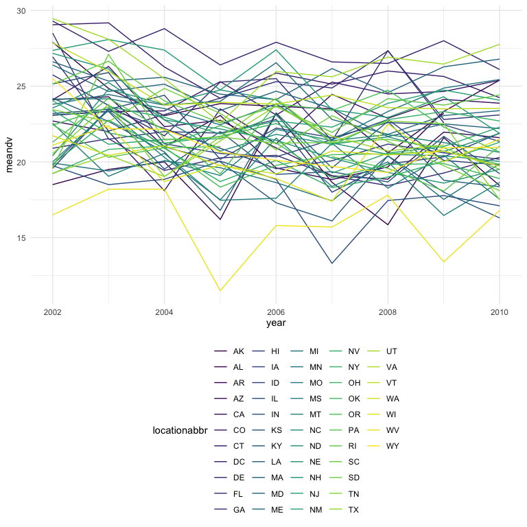

p8105\_hw3\_raj2152
================
Rachelle Juan
10/20/2021

## Problem 1

### Load the Instacart data for `p8105.datasets`

``` r
data("instacart")
```

The Instacart dataset has 1384617 observations and 15 variables. Each
row or observation corresponds to a single product within an Instacart
order, therefore, one order may map to several products (i.e., there is
a one-to-many relationship between orders and products). The variables
provide details on each order, including things like `order_id` and
`product_id` as well as the `user_id` of who placed the order. The
variables also include information on where each product is located, for
example: `aisle` and `department`.

-   There are 134 aisles. The aisles with the most items ordered from
    are: fresh vegetables, fresh fruits, packaged vegetables fruits,
    yogurt, and packaged cheese.

``` r
aisle_df = 
  instacart %>%
  count(aisle) %>% 
  arrange(desc(n)) %>%
  rename(quantity = n)
```

### Plotting Number of Items Ordered by Aisle, where number of items is greater than 10,000

-   This plot shows the number of items ordered in each aisle, limiting
    this to aisles with more than 10000 items ordered. The plot is in
    descending order based on quantity.

``` r
aisle_df %>% 
  filter(quantity > 10000) %>% 
  ggplot(aes(x = quantity, y = reorder(aisle, quantity))) +
  geom_bar(stat = "identity") +
  labs(
    x = "Number of Items Ordered",
    y = "Aisle"
  )
```


### Popular Items by Aisles

-   Make a table showing the three most popular items in each of the
    aisles “baking ingredients”, “dog food care”, and “packaged
    vegetables fruits”. Include the number of times each item is ordered
    in your table.

``` r
target = c("baking ingredients", "dog food care", "packaged vegetables fruits")

instacart %>% 
  select(aisle, product_name) %>% 
  filter(aisle %in% target) %>%
  group_by(aisle, product_name) %>% 
  count(product_name) %>% 
  arrange(desc(n)) %>% 
  group_by(aisle) %>% 
  slice(1:3) %>% 
  knitr::kable()
```

| aisle                      | product\_name                                 |    n |
|:---------------------------|:----------------------------------------------|-----:|
| baking ingredients         | Light Brown Sugar                             |  499 |
| baking ingredients         | Pure Baking Soda                              |  387 |
| baking ingredients         | Cane Sugar                                    |  336 |
| dog food care              | Snack Sticks Chicken & Rice Recipe Dog Treats |   30 |
| dog food care              | Organix Chicken & Brown Rice Recipe           |   28 |
| dog food care              | Small Dog Biscuits                            |   26 |
| packaged vegetables fruits | Organic Baby Spinach                          | 9784 |
| packaged vegetables fruits | Organic Raspberries                           | 5546 |
| packaged vegetables fruits | Organic Blueberries                           | 4966 |

### Pink Lady Apples and Coffee Ice Cream

-   Make a table showing the mean hour of the day at which Pink Lady
    Apples and Coffee Ice Cream are ordered on each day of the week;
    format this table for human readers (i.e. produce a 2 x 7 table).

``` r
instacart %>% 
  filter(product_name %in% c("Pink Lady Apples", "Coffee Ice Cream")) %>% 
  select(product_name, order_hour_of_day, order_dow) %>% 
  arrange(order_dow) %>% 
  mutate(order_dow = recode(order_dow, `0` = "Sunday", `1` = "Monday", `2` = "Tuesday", `3` = "Wednesday", `4` = "Thursday", `5` = "Friday", `6` = "Saturday")) %>% 
  pivot_wider(
    names_from = "order_dow",
    values_from = "order_hour_of_day",
    values_fn = mean
  ) %>% 
  knitr::kable()
```

| product\_name    |   Sunday |   Monday |  Tuesday | Wednesday | Thursday |   Friday | Saturday |
|:-----------------|---------:|---------:|---------:|----------:|---------:|---------:|---------:|
| Pink Lady Apples | 13.44118 | 11.36000 | 11.70213 |  14.25000 | 11.55172 | 12.78431 | 11.93750 |
| Coffee Ice Cream | 13.77419 | 14.31579 | 15.38095 |  15.31818 | 15.21739 | 12.26316 | 13.83333 |

## Problem 2

First, load the `BRFSS` dataset…

``` r
data("brfss_smart2010")
```

Then, clean the dataset…

``` r
brfss_df = 
  brfss_smart2010 %>% 
  janitor::clean_names() %>% 
  filter(
    topic == "Overall Health", 
    response %in% c("Poor", "Fair", "Good", "Very Good", "Excellent")
    ) %>% 
  mutate(response = factor(response, levels = c("Poor", "Fair", "Good", "Very Good", "Excellent"), ordered = TRUE))
```

-   In 2002, which states were observed at 7 or more locations? What
    about in 2010?

``` r
state02 = 
  brfss_df %>% 
  filter(year == 2002) %>% 
  group_by(locationabbr) %>% 
  count(locationabbr) %>% 
  filter(n >= 7)

state10 =
  brfss_df %>% 
  filter(year == 2010) %>% 
  group_by(locationabbr) %>% 
  count(locationabbr) %>% 
  filter(n >= 7)
```

In 2002, the following states were observed at 7 or more locations: AZ,
CO, CT, DE, FL, GA, HI, ID, IL, IN, KS, LA, MA, MD, ME, MI, MN, MO, NC,
NE, NH, NJ, NV, NY, OH, OK, OR, PA, RI, SC, SD, TN, TX, UT, VT, WA.

And in 2010 it was these states: AL, AR, AZ, CA, CO, CT, DE, FL, GA, HI,
IA, ID, IL, IN, KS, LA, MA, MD, ME, MI, MN, MO, MS, MT, NC, ND, NE, NH,
NJ, NM, NV, NY, OH, OK, OR, PA, RI, SC, SD, TN, TX, UT, VT, WA, WY

-   Construct a dataset that is limited to Excellent responses, and
    contains, year, state, and a variable that averages the data\_value
    across locations within a state. Make a “spaghetti” plot of this
    average value over time within a state

``` r
excell_df =
  brfss_df %>% 
  filter(response == "Excellent") %>% 
  group_by(locationabbr, year) %>% 
  mutate(meandv = mean(data_value)) %>% 
  select(year, locationabbr, meandv) %>% 
  distinct(locationabbr, .keep_all = TRUE)

excell_df %>% 
  ggplot(aes(x = year, y = meandv, group = locationabbr, color = locationabbr)) +
  geom_line()
```

    ## Warning: Removed 3 row(s) containing missing values (geom_path).



-   Make a two-panel plot showing, for the years 2006, and 2010,
    distribution of data\_value for responses (“Poor” to “Excellent”)
    among locations in NY State.

``` r
brfss_df %>% 
  filter(year %in% c(2006, 2010), locationabbr == "NY") %>% 
  ggplot(aes(x = response, y = data_value)) +
  geom_boxplot() +
  facet_grid(. ~ year)
```


