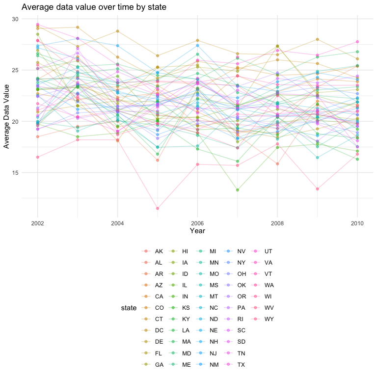
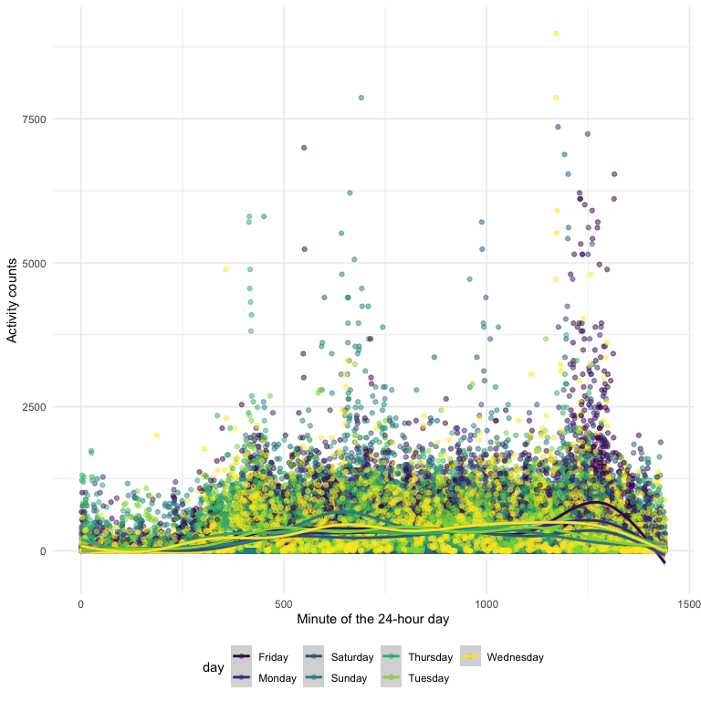

p8105\_hw3\_raj2152
================
Rachelle Juan
10/20/2021

## Problem 1

### Load the Instacart data for `p8105.datasets`

``` r
data("instacart")
```

The Instacart dataset has 1384617 observations and 15 variables. Each
row or observation corresponds to a single product within an Instacart
order, therefore, one order may map to several products (i.e., there is
a one-to-many relationship between orders and products). The variables
provide details on each order, including things like `order_id` and
`product_id` as well as the `user_id` of who placed the order. The
variables also include information on where each product is located, for
example: `aisle` and `department`.

There are 134 aisles. The aisles with the most items ordered from are:
fresh vegetables, fresh fruits, packaged vegetables fruits, yogurt, and
packaged cheese.

``` r
aisle_df = 
  instacart %>%
  count(aisle) %>% 
  arrange(desc(n)) %>%
  rename(quantity = n)
```

### Plotting Number of Items Ordered by Aisle, where number of items is greater than 10,000

*Make a plot that shows the number of items ordered in each aisle,
limiting this to aisles with more than 10000 items ordered. Arrange
aisles sensibly, and organize your plot so others can read it.*

``` r
aisle_df %>% 
  filter(quantity > 10000) %>% 
  ggplot(aes(x = quantity, y = reorder(aisle, quantity))) +
  geom_bar(stat = "identity") +
  labs(
    x = "Number of Items Ordered",
    y = "Aisle"
  )
```


This plot shows the number of items ordered in each aisle, limiting this
to aisles with more than 10000 items ordered. The plot is in descending
order based on quantity.

### Popular Items by Aisles

*Make a table showing the three most popular items in each of the aisles
“baking ingredients”, “dog food care”, and “packaged vegetables fruits”.
Include the number of times each item is ordered in your table.*

``` r
target = c("baking ingredients", "dog food care", "packaged vegetables fruits")

instacart %>% 
  select(aisle, product_name) %>% 
  filter(aisle %in% target) %>%
  group_by(aisle, product_name) %>% 
  count(product_name) %>% 
  arrange(desc(n)) %>% 
  group_by(aisle) %>% 
  slice(1:3) %>% 
  knitr::kable()
```

| aisle                      | product\_name                                 |    n |
|:---------------------------|:----------------------------------------------|-----:|
| baking ingredients         | Light Brown Sugar                             |  499 |
| baking ingredients         | Pure Baking Soda                              |  387 |
| baking ingredients         | Cane Sugar                                    |  336 |
| dog food care              | Snack Sticks Chicken & Rice Recipe Dog Treats |   30 |
| dog food care              | Organix Chicken & Brown Rice Recipe           |   28 |
| dog food care              | Small Dog Biscuits                            |   26 |
| packaged vegetables fruits | Organic Baby Spinach                          | 9784 |
| packaged vegetables fruits | Organic Raspberries                           | 5546 |
| packaged vegetables fruits | Organic Blueberries                           | 4966 |

### Pink Lady Apples and Coffee Ice Cream

*Make a table showing the mean hour of the day at which Pink Lady Apples
and Coffee Ice Cream are ordered on each day of the week; format this
table for human readers (i.e. produce a 2 x 7 table).*

``` r
instacart %>% 
  filter(product_name %in% c("Pink Lady Apples", "Coffee Ice Cream")) %>% 
  select(product_name, order_hour_of_day, order_dow) %>% 
  arrange(order_dow) %>% 
  mutate(order_dow = recode(order_dow, `0` = "Sunday", `1` = "Monday", `2` = "Tuesday", `3` = "Wednesday", `4` = "Thursday", `5` = "Friday", `6` = "Saturday")) %>% 
  pivot_wider(
    names_from = "order_dow",
    values_from = "order_hour_of_day",
    values_fn = mean
  ) %>% 
  knitr::kable()
```

| product\_name    |   Sunday |   Monday |  Tuesday | Wednesday | Thursday |   Friday | Saturday |
|:-----------------|---------:|---------:|---------:|----------:|---------:|---------:|---------:|
| Pink Lady Apples | 13.44118 | 11.36000 | 11.70213 |  14.25000 | 11.55172 | 12.78431 | 11.93750 |
| Coffee Ice Cream | 13.77419 | 14.31579 | 15.38095 |  15.31818 | 15.21739 | 12.26316 | 13.83333 |

## Problem 2

First, load the `BRFSS` dataset…

``` r
data("brfss_smart2010")
```

Then, clean the dataset…

``` r
brfss_df = 
  brfss_smart2010 %>% 
  janitor::clean_names() %>% 
  filter(
    topic == "Overall Health", 
    response %in% c("Poor", "Fair", "Good", "Very Good", "Excellent")
    ) %>% 
  mutate(response = factor(response, levels = c("Poor", "Fair", "Good", "Very Good", "Excellent"), ordered = TRUE))
```

### States with 7 or more locations

*In 2002, which states were observed at 7 or more locations? What about
in 2010?*

``` r
state02 = 
  brfss_df %>% 
  filter(year == 2002) %>% 
  group_by(locationabbr) %>% 
  count(locationabbr) %>% 
  filter(n >= 7)

state10 =
  brfss_df %>% 
  filter(year == 2010) %>% 
  group_by(locationabbr) %>% 
  count(locationabbr) %>% 
  filter(n >= 7)
```

In **2002**, the following states were observed at 7 or more locations:
AZ, CO, CT, DE, FL, GA, HI, ID, IL, IN, KS, LA, MA, MD, ME, MI, MN, MO,
NC, NE, NH, NJ, NV, NY, OH, OK, OR, PA, RI, SC, SD, TN, TX, UT, VT, WA.

And in **2010** it was these states: AL, AR, AZ, CA, CO, CT, DE, FL, GA,
HI, IA, ID, IL, IN, KS, LA, MA, MD, ME, MI, MN, MO, MS, MT, NC, ND, NE,
NH, NJ, NM, NV, NY, OH, OK, OR, PA, RI, SC, SD, TN, TX, UT, VT, WA, WY

### Excellent responses

*Construct a dataset that is limited to Excellent responses, and
contains, year, state, and a variable that averages the data\_value
across locations within a state. Make a “spaghetti” plot of this average
value over time within a state*

``` r
excell_df =
  brfss_df %>% 
  filter(response == "Excellent") %>% 
  group_by(locationabbr, year) %>% 
  mutate(meandv = mean(data_value)) %>% 
  select(year, locationabbr, meandv) %>% 
  distinct(locationabbr, .keep_all = TRUE)

excell_df %>% 
  ggplot(aes(x = year, y = meandv, group = locationabbr, color = locationabbr)) +
  geom_line()
```

    ## Warning: Removed 3 row(s) containing missing values (geom_path).


### Distribution of data\_value for Poor to Excellent in NY State

*Make a two-panel plot showing, for the years 2006, and 2010,
distribution of data\_value for responses (“Poor” to “Excellent”) among
locations in NY State.*

``` r
brfss_df %>% 
  filter(year %in% c(2006, 2010), locationabbr == "NY") %>% 
  ggplot(aes(x = response, y = data_value)) +
  geom_boxplot() +
  facet_grid(. ~ year) +
  labs(
    x = "Response",
    y = "Data Value"
  )
```



## Problem 3

Load and tidy the accel\_data.csv dataset…

``` r
accel_df = 
  read_csv("./data/accel_data.csv") %>% 
  janitor::clean_names() %>% 
  pivot_longer(
    activity_1:activity_1440,
    names_to = "minute_of_day",
    names_prefix = "activity_",
    values_to = "activity"
  ) %>% 
  mutate(
    day_type = ifelse(day %in% c("Saturday", "Sunday"), "weekend", "weekday"),
    day_type = factor(day_type),
    day = factor(day),
    minute_of_day = as.numeric(minute_of_day)
  )
```

    ## Rows: 35 Columns: 1443

    ## ── Column specification ────────────────────────────────────────────────────────
    ## Delimiter: ","
    ## chr    (1): day
    ## dbl (1442): week, day_id, activity.1, activity.2, activity.3, activity.4, ac...

    ## 
    ## ℹ Use `spec()` to retrieve the full column specification for this data.
    ## ℹ Specify the column types or set `show_col_types = FALSE` to quiet this message.

There are 6 variables in the `accel_df` dataframe including: activity,
day, day\_id, day\_type, minute\_of\_day, week. Each row of the dataset
includes the 63 year-old male’s activity counts at each minute of a
24-hour day. The dataset includes 50400 observations.

### Total activity counts for each day

*Traditional analyses of accelerometer data focus on the total activity
over the day. Using your tidied dataset, aggregate accross minutes to
create a total activity variable for each day, and create a table
showing these totals. Are any trends apparent?*

``` r
agg_day_df =
  accel_df %>% 
  group_by(day_id) %>% 
  mutate(total_day_activity = sum(activity)) %>% 
  distinct(day_id, .keep_all = TRUE) %>% 
  select(-activity, -minute_of_day) %>% 
  relocate(day_type, .after = day) 

agg_day_df %>% 
  knitr::kable()
```

| week | day\_id | day       | day\_type | total\_day\_activity |
|-----:|--------:|:----------|:----------|---------------------:|
|    1 |       1 | Friday    | weekday   |            480542.62 |
|    1 |       2 | Monday    | weekday   |             78828.07 |
|    1 |       3 | Saturday  | weekend   |            376254.00 |
|    1 |       4 | Sunday    | weekend   |            631105.00 |
|    1 |       5 | Thursday  | weekday   |            355923.64 |
|    1 |       6 | Tuesday   | weekday   |            307094.24 |
|    1 |       7 | Wednesday | weekday   |            340115.01 |
|    2 |       8 | Friday    | weekday   |            568839.00 |
|    2 |       9 | Monday    | weekday   |            295431.00 |
|    2 |      10 | Saturday  | weekend   |            607175.00 |
|    2 |      11 | Sunday    | weekend   |            422018.00 |
|    2 |      12 | Thursday  | weekday   |            474048.00 |
|    2 |      13 | Tuesday   | weekday   |            423245.00 |
|    2 |      14 | Wednesday | weekday   |            440962.00 |
|    3 |      15 | Friday    | weekday   |            467420.00 |
|    3 |      16 | Monday    | weekday   |            685910.00 |
|    3 |      17 | Saturday  | weekend   |            382928.00 |
|    3 |      18 | Sunday    | weekend   |            467052.00 |
|    3 |      19 | Thursday  | weekday   |            371230.00 |
|    3 |      20 | Tuesday   | weekday   |            381507.00 |
|    3 |      21 | Wednesday | weekday   |            468869.00 |
|    4 |      22 | Friday    | weekday   |            154049.00 |
|    4 |      23 | Monday    | weekday   |            409450.00 |
|    4 |      24 | Saturday  | weekend   |              1440.00 |
|    4 |      25 | Sunday    | weekend   |            260617.00 |
|    4 |      26 | Thursday  | weekday   |            340291.00 |
|    4 |      27 | Tuesday   | weekday   |            319568.00 |
|    4 |      28 | Wednesday | weekday   |            434460.00 |
|    5 |      29 | Friday    | weekday   |            620860.00 |
|    5 |      30 | Monday    | weekday   |            389080.00 |
|    5 |      31 | Saturday  | weekend   |              1440.00 |
|    5 |      32 | Sunday    | weekend   |            138421.00 |
|    5 |      33 | Thursday  | weekday   |            549658.00 |
|    5 |      34 | Tuesday   | weekday   |            367824.00 |
|    5 |      35 | Wednesday | weekday   |            445366.00 |

From this table, we see that activity tends to be lower on weekends than
on weekdays.

### 24-hour activity for each day of the week

*Accelerometer data allows the inspection activity over the course of
the day. Make a single-panel plot that shows the 24-hour activity time
courses for each day and use color to indicate day of the week. Describe
in words any patterns or conclusions you can make based on this graph.*

``` r
accel_df %>% 
  ggplot(aes(x = minute_of_day, y = activity, color = day)) +
  geom_point(alpha = .5) + 
  geom_smooth() + 
  labs(
    x = "Minute of the 24-hour day",
    y = "Activity counts"
  )
```

    ## `geom_smooth()` using method = 'gam' and formula 'y ~ s(x, bs = "cs")'



From the plot, we can see that activity begins around minute 250 of the
day (approx 4 am) and peaks and decreases around minute 1250 of the day
(approx 8pm). The times of the day with the most activity are around
minute 750 (approx 12:30pm) and between minute 1000-1250 (approx 4-8pm).
